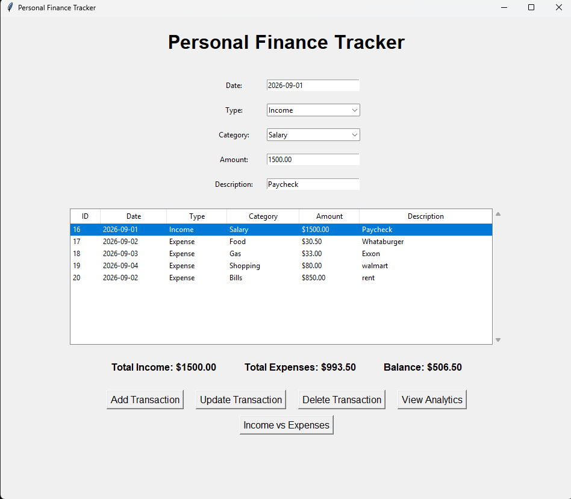
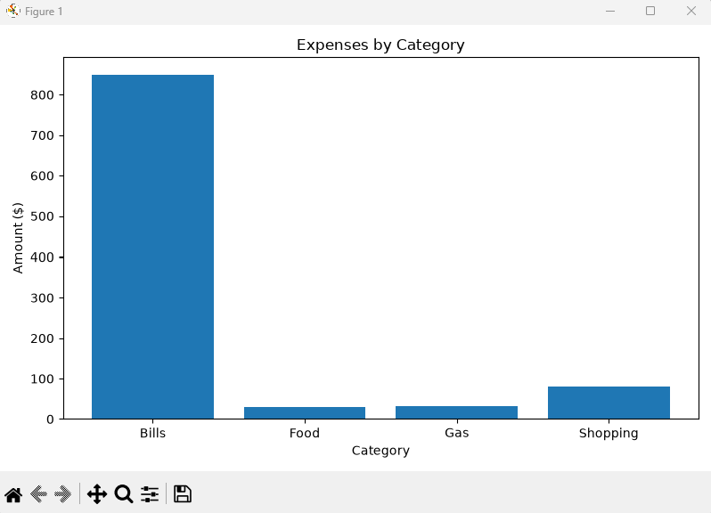
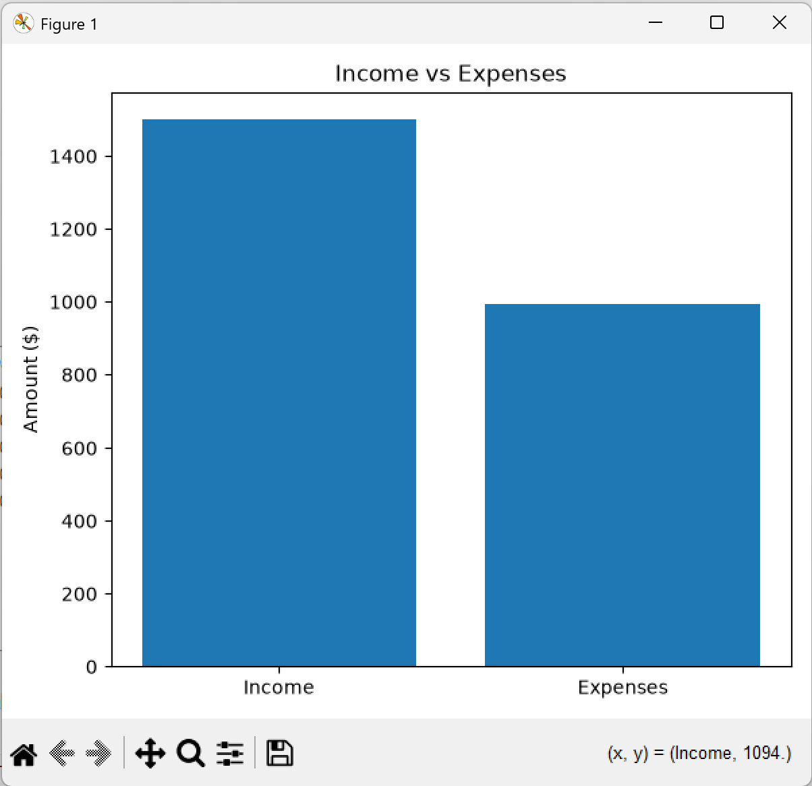

# Personal Finance Tracker

A desktop personal finance management application built with Python, SQLite, Tkinter, and Matplotlib. The application provides full CRUD functionality for managing income and expense transactions, persistent SQLite storage, financial summaries, input validation, and interactive data visualizations.

## Features

- Add income and expense transactions
- View saved transactions
- Update existing transactions
- Delete transactions
- Track total income
- Track total expenses
- Calculate current balance
- View expenses by category
- Compare income vs expenses
- Validate dates and transaction amounts
- Store data using SQLite

## Screenshots

### Main Application



### Expenses by Category



### Income vs Expenses



## Technologies Used

- Python
- SQLite
- Tkinter
- Matplotlib
- SQL

## CRUD Operations

The application supports full CRUD functionality:

- Create: Add new transactions
- Read: Display saved transactions
- Update: Edit existing transactions
- Delete: Remove transactions

## Database

Transactions are stored in a SQLite database with the following fields:

- ID
- Date
- Type
- Category
- Amount
- Description

## How to Run

1. Install Python.
2. Install the required package:

```bash
pip install -r requirements.txt
